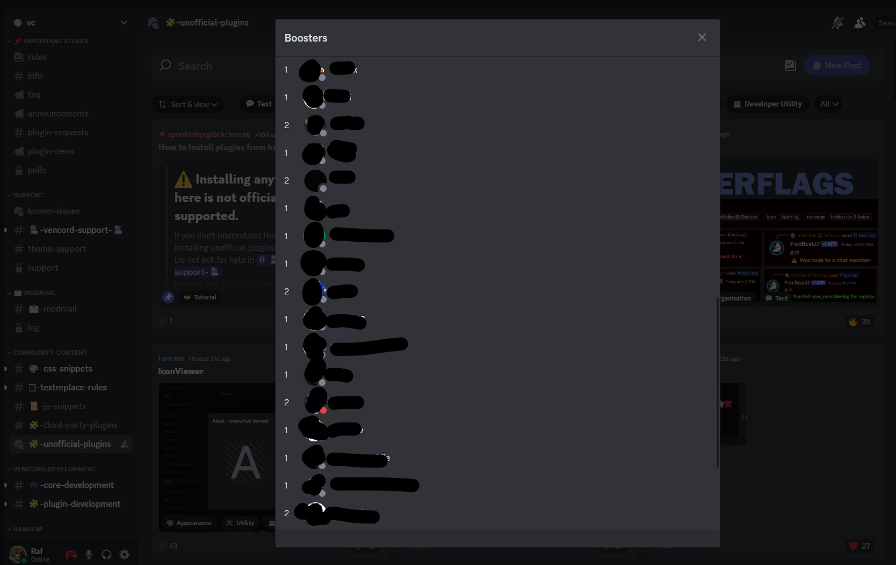

# BoosterCount

> A [Vencord](https://vencord.dev/) plugin that shows who is boosting a Discord server, and how many boosts each member has given.




Discord only shows a "booster" badge next to members. It doesn't show how many boosts each person contributes.
BoosterCount adds a **View Boosters** entry to the server context menu. It opens a modal that lists every booster
with their avatar, name and number of active boosts.

## Features

- **One click.** Right-click any server and choose **View Boosters**.
- **Boost count per member.** Multiple boosts from the same user are grouped and counted (`3x`, `2x`, ...).
- **Click a booster to open their profile.**
- **Works with large servers.** Members not yet in Discord's local cache are fetched on demand, and the list
  re-renders as they arrive.

## How it works

| Step | Implementation |
| --- | --- |
| Context-menu entry | Patches Vencord's `guild-context` menu with a `Menu.MenuItem` |
| Data source | Calls Discord's `GET /guilds/{id}/premium/subscriptions` endpoint with the current session |
| Aggregation | Groups subscriptions by user id to count boosts per member |
| Missing members | Dispatches a `GUILD_MEMBERS_REQUEST` through Discord's Flux dispatcher, then reacts to `GuildMemberStore` updates with `useStateFromStores` |
| UI | Native Discord components (`Modal`, `ScrollerThin`, `Text`, `Flex`) so it looks like the rest of the client |

All the code is in [`index.tsx`](index.tsx).

## Installation

BoosterCount is a *user plugin*, so you need a Vencord build from source.
If you haven't set one up yet, follow the official guide:
[Installing custom plugins](https://docs.vencord.dev/installing/custom-plugins/).

Once you have cloned Vencord and created the `src/userplugins` folder:

```bash
cd Vencord/src/userplugins
git clone https://github.com/Reathe/BoosterCount
```

Then [build and inject Vencord](https://docs.vencord.dev/installing/) again (`pnpm build && pnpm inject`),
restart Discord, and enable **BoostCounts** in *Settings → Vencord → Plugins*.

## Usage

1. Right-click a server icon in the server list.
2. Click **View Boosters**.
3. Browse the list. Click a member to open their profile.

## Updating

```bash
cd Vencord/src/userplugins/BoosterCount
git pull
```

Then rebuild and re-inject Vencord.

## Disclaimer

Client mods are against Discord's Terms of Service. Use this plugin at your own risk.
